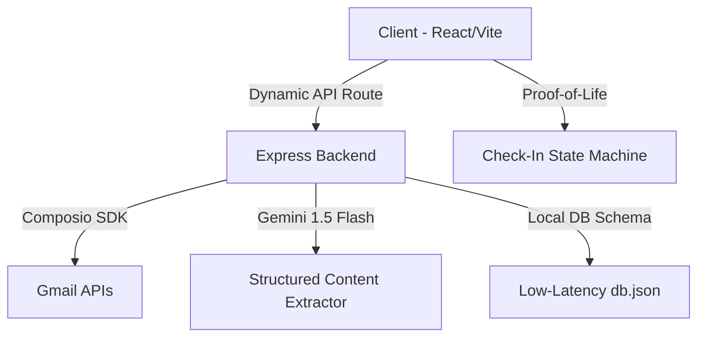

# 🛡️ Life Continuity AI
> **Never let your critical responsibilities fade. A high-reliability emergency handover and obligation tracker powered by Google Gemini and Composio.**

---

## 🌟 Product Vision
**Life Continuity AI** is a resilient, privacy-first personal fail-safe designed to bridge the gap between active daily management and emergency family coordination. By continuous synchronizing of critical life indicators, it helps prevent catastrophic service interruptions or coordination failures during unplanned absences.

### Key Capabilities
- **📬 Automated Gmail Sync**: Secure integration using Composio to pull, process, and classify notifications regarding bills, loans, appointments, and travel.
- **📁 Secure Document Vault**: Deep OCR and action-item extraction of uploaded insurance policies, wills, and health reports.
- **📊 Care & Obligation Heatmap**: A dynamic, urgency-based visualization mapping all life commitments by deadline proximity.
- **🚨 Emergency Playbook Handover**: Auto-triggering nominee handovers (Missed Check-In / Manual Trigger) with cryptographic summaries.

---

## 🏗️ Architectural Overview



### Technical Stack & Integrations
- **Frontend**: React + TypeScript + Tailwind CSS (Vite build pipeline).
- **Backend**: Express + Node.js with dynamic CORS policies (supporting credential-based cross-origin mapping).
- **Integrations**:
  - **Composio**: Manages workspace triggers and secure Gmail authorization links.
  - **Google Gemini (AI Studio)**: Summarizes inbox alerts and performs metadata extraction for vaults.

---

## 🚀 Key Features Under the Hood

### 1. Urgency-Coded Heatmap Grid
The **Care & Obligation Heatmap** automatically aligns events across all data sources (Gmail sync, Vault uploads, manual records) and visualizes them by deadline proximity:
* 🔴 **Critical Priority**: Overdue or due today (`diffDays <= 0`)
* 🟠 **High Priority**: Due within 3 days (`diffDays <= 3`)
* 🟡 **Medium Priority**: Due within 7 days (`diffDays <= 7`)
* 🟢 **Low Priority**: Due later (`diffDays > 7`)

### 2. High-Reliability Local Routing
The API fetches dynamically detect local development environments (`localhost` / local network IPs) and route calls to the local express server rather than bypassing it to production, keeping dev-flows offline and isolated.

### 3. Fail-Safe Parsing Engine
Our dynamic date extractor leverages multi-format regex engines capable of parsing ISO dates (`YYYY-MM-DD`) and natural language timestamp formats (e.g., `July 22nd, 2026`) directly from email bodies and vault documents.

---

## ⚙️ Local Development Quick Start

### Prerequisites
- Node.js (v18+)
- NPM or Yarn

### 1. Configure Environment Variables
Create a `.env` file in the project root:
```env
PORT=3000
GEMINI_API_KEY=your_gemini_api_key
COMPOSIO_API_KEY=your_composio_api_key
COMPOSIO_GMAIL_AUTH_CONFIG_ID=your_gmail_auth_config_id
VITE_API_BASE_URL=https://your-production-backend.up.railway.app
```

### 2. Install and Run
```bash
# Install dependencies
npm install

# Run frontend (Vite) and backend (Express) concurrently
npm run dev
```
Open `http://localhost:3000` in your web browser.

---

## 🌐 Production Deployment

### Backend (Railway)
This project is configured with a node packaging server ready for Railway deployment.
1. Run `railway login` and `railway link` inside the project folder.
2. Deploy code using `railway up`.
3. Set your production environment variables (CORS automatically adapts to reflect request origins).

### Frontend (Vercel)
Build commands are mapped via `vercel.json` to handle client routers cleanly:
- Build Command: `vite build`
- Output Directory: `dist`

---

## 🔒 Security & Privacy Posture
- **Zero-Storage Data Policies**: Original email snippets and vault uploads stay secure within your database instances.
- **Nominee Encryption**: Handover keys are resolved only upon verified escalations to prevent information leakage.
